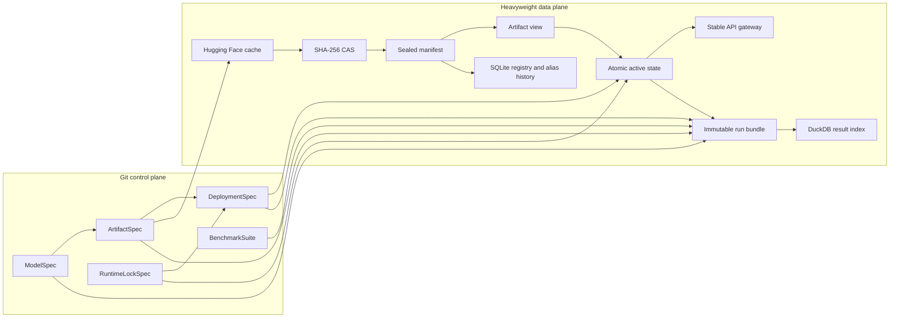

# Architecture

LLM Lab separates declarative intent from large mutable caches and from
immutable evidence. The design is intentionally conservative: bytes are
identified by hashes, catalog references are explicit, only one local GPU
deployment is active at a time, and comparisons never guess how to score a task
that is absent.

## System shape



The Git repository is small and reviewable. The data root holds caches,
artifact bytes, runtime state, logs, run bundles, and local indexes. Its location
is selected by `LLM_LAB_DATA`; it must not be committed.

## The five declarative identities

Five identities are required because each changes for a different reason.
Collapsing any pair loses information needed to reproduce or safely roll back a
result. Runtime state and a run ID are evidence records derived from these
layers; they are not substitutes for the declarative identities.

### 1. Model identity

`ModelSpec.id` describes the intended upstream model independently of a runtime
package. It records:

- display name and family;
- total and active parameter counts;
- native context and modalities;
- declared capabilities;
- license name, link, commercial/OSI/acceptance flags; and
- official upstream repository plus a pinned revision.

A model entry answers “what learned behavior do we mean?” It does not imply that
the full-precision checkpoint fits the workstation.

### 2. Artifact identity

`ArtifactSpec.id` describes one runnable packaging of a model. It records source
repository and revision, format, quantization, expected selected size, file
selectors and roles, remote-code requirements, and provenance notes.

The selected files are promoted into an `ArtifactManifest`. Each locked file has
a logical path, role, byte size, SHA-256, and `sha256:<digest>` storage URI. The
manifest also contains a deterministic tree hash and a canonical manifest hash.
The observational `created_at` timestamp is excluded from identity, so identical
reviewed bytes and provenance receive the same digest across installations.
Changing quantization, a vision projector, tokenizer, conversion source, or any
byte creates a different artifact identity.

The model's upstream can be an official checkpoint while the artifact source is
a pinned community conversion. Both references are retained; provenance is not
flattened into one ambiguous repository name.

### 3. Deployment identity

`DeploymentSpec.id` describes how an artifact is exposed. It includes backend,
container image or executable, host and port, context size, concurrency, GPU
layer policy, flash attention, KV-cache types, reasoning mode, health path,
startup timeout, environment, additional backend arguments, and the applicable
`runtime_lock_id` for a host process.

The deployment also has a unique `public_alias`, such as `local-general`. This
is the model string sent by API clients. It is distinct from a **registry
alias**, which is an audited mutable pointer to an artifact. Keeping these two
alias namespaces separate prevents a client-visible route from silently
changing artifact bytes.

### 4. Runtime-lock identity

`RuntimeLockSpec.id` describes the reviewed host runtime independently of any
model artifact. It records the runtime source and exact Git commit, build
recipe, data-root-relative binary path, expected binary SHA-256, required
version-output evidence, and the hardware on which that result was verified.

Every checked-in real deployment references `llama-cpp-cuda-4090`; only the
mock canary has no runtime lock. A host deployment without an immutable
container image is rejected by catalog validation if it lacks a reviewed lock.
Container deployments instead require an image digest, either embedded in the
reference or supplied as the matching reviewed digest field.

The build recipe alone is not executable identity: compiler and dependency
differences can change its output. Activation therefore verifies the exact
binary path, bytes, and version evidence recorded by the lock, and records the
resolved executable SHA-256 and version in runtime state.

### 5. Suite identity

`BenchmarkSuite.id` plus `version` identifies prompts and their evaluation
contract. A suite fixes:

- kind and description;
- default sampling values;
- warmup and measured repetition counts;
- case messages and per-case request overrides such as tools or response format;
- required capabilities and tags; and
- exact, contains, regular-expression, JSON Schema, tool-name, or nonempty
  expectations.

The complete validated suite definition is serialized into each run and hashed
canonically with SHA-256. Prompt, scoring, sampling, or coverage changes should
also receive a suite version change, but comparison safety does not trust the
friendly ID/version alone: selected runs must have the same content digest.

The runner also creates a canonical, model-normalized **effective request
contract** after applying suite, runner, and per-run protocol extensions. One
deep JSON snapshot drives both this digest and every warmup/measured request,
and bundle verification binds each recorded sample back to it. This prevents
two superficially identical suite versions from being compared when an
extension changed the actual HTTP workload.

Case extensions may add protocol fields such as tools or `response_format`, but
cannot replace `model`, `messages`, typed generation fields (`temperature`,
`top_p`, `max_tokens`, or `seed`), or `stream`. The runner applies this rule to
case, runner, and per-run extensions and rejects a response that reports a
different model identity.

### Run identity

A run is a unique evidence record, not another reusable configuration layer. It
joins the five applicable identities with start/finish timestamps, status,
resolved runtime and hardware information, endpoint attestation, sampling
metadata, measured samples, and telemetry.

This makes questions such as “same model?” precise: the answer can differ at the
artifact, deployment, or suite layer even when the model ID is unchanged.

## Two-tier Hugging Face and CAS storage

The upstream cache and the managed CAS have different trust and lifecycle
roles.

### Tier 1: upstream acquisition cache

`upstream/hf/hub`, `upstream/hf/xet`, and `upstream/hf/assets` are the Hugging
Face acquisition tier. A pull:

1. resolves the catalog revision to a full commit;
2. requests only cataloged file patterns;
3. downloads into the dedicated Hub cache;
4. verifies that required selectors match; and
5. checks the selected byte total against `expected_size_bytes` when provided.

This tier preserves Hub/Xet layout and enables resume or offline reuse. It is a
cache, not the artifact identity authority.

### Tier 2: managed content-addressed store

`blobs/sha256/<digest>` is the byte authority. Promotion hashes selected files,
checks that a source did not change during hashing, reuses an existing verified
blob, and installs new blobs read-only. It **copies by default** so later cache
mutation cannot alter a shared CAS inode. Explicit `blob_install_mode="hardlink"`
adopts the source inode as read-only CAS content and falls back to copying if a
link is unavailable; that coupling is an operator choice, not a transparent
optimization.

After every blob exists, promotion:

1. creates and seals a canonical artifact manifest;
2. publishes `manifests/<artifact-id>/<manifest-sha>.json`;
3. atomically publishes `views/<artifact-id>/` using links or verified copies;
4. registers the immutable artifact in SQLite; and
5. optionally advances an audited registry alias.

Manifests and registered/on-disk manifests are garbage-collection roots. CAS GC
is a dry run by default and refuses to proceed if an on-disk manifest cannot be
validated. Views prefer symlinks, then hard links, and finally verified copies;
they are convenience paths, while hashes and manifests remain authority.

### Claimed-root and no-symlink boundary

`LabPaths.initialize()` claims a dedicated data root with a private regular-file
sentinel named `.llm-lab-root`. The sentinel has a fixed schema marker and must
not be a symlink or hard link. A first initialization accepts an empty directory
or one containing only the expected top-level LLM Lab directories; unexpected
entries cause initialization to fail instead of silently claiming unrelated
data.

The data root itself and every managed directory component are opened with
no-follow directory checks. Symlink substitution of `blobs`, `manifests`,
`state`, `logs`, or another managed root is rejected. GPU lock files, state
files, and log targets likewise use no-follow regular-file validation. This
managed-control-path rule is distinct from an artifact view member: a view may
use a relative link only when verification proves that it resolves to the
expected in-root CAS blob with the expected hash.

### Data-plane layout

`LabPaths.initialize()` creates this structure:

```text
.llm-lab-root                   ownership/schema sentinel
upstream/hf/{hub,xet,assets}/  acquisition cache
blobs/sha256/                  immutable CAS objects
manifests/                     sealed artifact manifests
views/                         runnable artifact trees
datasets/                      local evaluation inputs
runs/                          immutable run bundles
registry/catalog.sqlite        artifact, alias, history, and run registry
results/results.duckdb         analytical result index
cache/                         source/build caches such as llama.cpp
work/{download,convert,verify}/ bounded scratch space
quarantine/                    operator-controlled isolation area
state/                         locks and atomic active deployment state
logs/                          backend logs
```

## 2.7 TB capacity policy

The data plane has a **2.7 TB decimal operating envelope**
(2,700,000,000,000 bytes). Capacity is managed against physical filesystem use,
not the sum of logical manifest sizes, because hard links, Hub/Xet storage, and
conversion scratch can make those numbers differ.

The repository policy is:

- reserve 20% (540 GB) for downloads in progress, conversions, verification,
  databases, logs, and OS/filesystem behavior;
- warn at 70% managed use (1.89 TB);
- run registry-aware retention review and GC at 75% (2.025 TB);
- block ordinary ingestion at 80% (2.16 TB); and
- estimate a new artifact pessimistically as two selected copies—upstream plus
  CAS—plus conversion scratch, even though same-filesystem hard links may reduce
  actual use.

`ArtifactStore` can enforce the free-space component when constructed with
`free_reserve_bytes=540_000_000_000`; `llmctl artifact pull` uses that value by
default. This is not a global quota daemon, so operators must also check total
data-root use before acquisition. `expected_size_bytes` covers selected artifact files;
it does not cover all Hub metadata, Xet chunks, Docker images, build caches, KV
cache, or temporary converter output.

The starter artifacts total 56.89 GB selected. Even with a pessimistic separate
Hub and CAS copy, their 113.79 GB working set is about 4.21% of the envelope.
That leaves room for experiments, but it is not permission to retain every
precision of every model indefinitely.

## Common OpenAI-compatible API

The runtime layer materializes backend-specific launch commands, while callers
use one contract:

```text
GET  <deployment health_path>
POST /v1/chat/completions
model = <deployment public_alias>
```

llama.cpp receives `--alias`; vLLM receives `--served-model-name`. SGLang,
TensorRT-LLM, and external endpoints share the intended request contract but
must be validated against the checked-in smoke suite for the exact pinned
runtime.

The FastAPI gateway provides the stable client address. It reloads atomic active
state for every request, rejects absent/non-ready state with an OpenAI-shaped
503, joins upstream paths without duplicating `/v1`, and proxies:

- `GET /v1/models`;
- `POST /v1/chat/completions`;
- `POST /v1/completions`; and
- `POST /v1/responses`.

JSON and server-sent-event streaming bodies pass through without semantic
rewriting. Optional bearer authentication protects `/v1/*`; `/health` reports
gateway and active-state status without authentication. The gateway routes a
common protocol but does not make a nonconforming backend conform.

Container artifact mounts are read-only. Local defaults bind to `127.0.0.1`;
container commands bind inside the container and publish only the cataloged host
port. Gateway bearer authentication is optional, and TLS termination remains an
external responsibility.

## Runtime state and rollback

`RuntimeManager` serializes transitions with `state/gpu0.lock`, reflecting the
single-GPU design. Active state is written by atomic file replacement and stores
the full deployment, materialized launch plan, artifact path, and resolved
launch record.

Activation is health-gated:

1. verify the applicable runtime-lock path, binary SHA-256, and version output;
2. acquire the GPU lock;
3. remember and stop the current deployment;
4. start the candidate and confirm its recorded executable identity still
   matches the pre-launch verification;
5. write `starting` state and wait for the configured health endpoint;
6. publish `ready` state; or
7. on failure, stop the candidate and try to restart the previous deployment
   with its recorded resolved executable or container image.

If both activation and restoration fail, active state is cleared only after
process/container absence is confirmed. If cleanup cannot be confirmed, a
`failed` state preserves the possible owner's identity for manual recovery and
no second GPU owner is started. The raised error reports both failures. A host
rollback also requires the restored path and SHA-256 to match the previously
active launch record. A stale state file is never enough to declare a deployment
ready: status also checks process/container liveness and, by default, health.

The SQLite registry provides a separate `rollback_alias()` operation. Alias
rollback appends history and advances its generation; it does not rewrite or
delete artifacts.

## Reproducible benchmark evidence

`BenchmarkRunner` sends non-streaming OpenAI-compatible requests sequentially.
Warmups are executed but excluded from measured results. Measured requests
retain end-to-end latency, normalized token usage, client completion throughput,
optional backend-native timings, response/tool data, scorer details, and
structured errors; one API error does not abort the rest of a suite. Unsupported
cases can be skipped when capabilities are supplied explicitly.

`latency_ms` covers the complete non-streaming HTTP request. The client metric
`client_completion_tokens_per_second` is reported completion tokens divided by
that elapsed time. If llama.cpp returns its `timings` object, prompt and
predicted/decode timing fields are normalized separately and preserved raw.
Neither the end-to-end latency nor completion-throughput metric is TTFT; the
runner does not measure TTFT.

The CLI benchmarks only a catalog definition identical to the ready active
deployment, after re-verifying its artifact and applicable runtime lock. The
active backend URL is accepted directly. A `--base-url` override is accepted
only when its unauthenticated `/health` endpoint attests that it is an LLM Lab
gateway routing that same ready deployment ID and public alias. The exact
attestation is stored in runtime metadata.

`NvidiaTelemetrySampler` records utilization, memory, temperature, power, and
clock data when `nvidia-smi` is available. A missing driver, no GPU, malformed
row, or command failure produces an explicit unavailable observation rather
than failing the benchmark.

`write_run_bundle()` publishes a directory atomically and refuses to overwrite
an existing path. It contains exactly `run.json`, `summary.json`,
`samples.jsonl`, and `telemetry.jsonl`. `run.json` embeds the complete suite
definition and canonical SHA-256, then hashes the run metadata and the other
three files; verification checks the suite digest, counts, run IDs, sizes, and
file hashes.

`ResultsStore` verifies each bundle before appending normalized records to
DuckDB. Comparisons expose per-case rows. A composite is available only when all
selected runs carry the same suite ID, version, content SHA-256, and effective
request-contract SHA-256; contain the same task set; score every task; and have
neither measured nor warmup errors. Legacy runs without verifiable suite,
request-contract, or complete error accounting cannot produce a composite.
Missing work is reported as missing, never converted to zero or silently
dropped.

## Trust and reproducibility boundaries

- A pinned repository commit establishes provenance, not publisher identity or
  semantic correctness; hashes establish the exact downloaded bytes.
- `requires_remote_code` is explicit. All starter artifacts currently set it to
  false; changing it requires security review.
- A mutable container tag is not a complete runtime lock. `RuntimeImage.digest`
  must identify the reviewed image unless the reference already embeds that
  same digest. Host deployments use a `RuntimeLockSpec` such as
  `catalog/runtime-locks/llama-cpp-cuda.yaml`; launch records retain the exact
  executable SHA-256/version or image information for rollback.
- Model licenses are independent of this repository's package license. Review
  the license record and upstream terms before pulling or deploying.
- Benchmark output can contain prompts, model responses, paths, or tool data.
  Treat run bundles as potentially sensitive even though they are local.
- The workstation owner account is the trust boundary. No-follow opens,
  private managed directories, immutable modes, hashes, and pre-transaction
  sidecar checks prevent accidental substitution and fail closed on planted
  links. They are not a sandbox against another actively malicious process
  running as the same UID, which can change owner permissions or race a database
  engine's own WAL creation. Use a dedicated service account or stronger OS
  isolation when mutually untrusted local processes share the machine.
