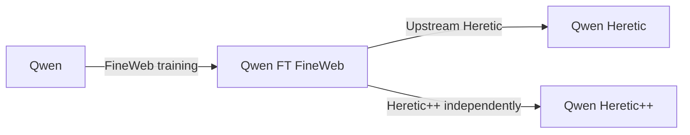

# Qwen comparison: capability, useful answers, and cost

The aim is to choose the best model for our LLM Lab with evidence about what improves, what regresses, and what it costs on our shared RTX 4090. A lower refusal rate alone is not a win. Useful, correct answers and retained capabilities matter together.

Status, 2026-09-13: The comparison pipeline and Heretic++ extensions are implemented and CPU validated. A durable systemd supervisor is waiting for the active FineWeb run to finish and export before it starts GPU stages. The final 937 cases per arm and 469 development cases are frozen. GPU validation, searches, model results, and independent final review remain pending. See the [execution guide](../../benchmarks/qwen-comparison/README.md) for current paths, commands, and validation evidence.

## Four models, one controlled comparison

| Display name | Input | Change | Status |
|---|---|---|---|
| Qwen | Pinned original Qwen3.8-27B | None | Available |
| Qwen FT FineWeb | Original Qwen | Existing 24-hour FineWeb QLoRA run | Training |
| Qwen Heretic | Completed FineWeb model | Pinned upstream Heretic | Prepared; not run |
| Qwen Heretic++ | Completed FineWeb model | Semantic scoring, multi-position KL, constrained selection | Implemented; GPU probe pending |

This lineage is the working assumption matching the prepared post-training workflow. Both Heretic variants start from exactly the same FineWeb checkpoint; Heretic++ does not start from the Heretic output. We measure FT versus original, Heretic versus FT, and especially Heretic++ versus Heretic. A fifth arm, original Qwen processed by Heretic, would be needed to isolate Heretic's effect without FineWeb training.

## The scorecard

Use four model columns, grouped metric rows, and a paired difference beside each treatment. Show confidence intervals, sample counts, and failure rates. Missing results say **pending**, never zero. Keep an expandable failure browser with prompts, responses, expected outcomes, and evaluator explanations. Do not collapse everything into an arbitrary overall score.

| Dimension | Core workload per model | Report |
|---|---:|---|
| Following instructions | 128 IFEval prompts | Strict prompt accuracy ↑ |
| Reasoning and knowledge | 128 GSM8K + 140 MMLU-Pro | Answer accuracy ↑; MMLU-Pro subject macro average ↑ |
| Coding | 164 HumanEval+ problems | Execution-tested pass@1 ↑ |
| Useful answers | 125 safe XSTest prompts | Useful answer rate ↑; false refusal rate ↓ |
| Boundary behavior | 100 XSTest contrast prompts | Rubric-appropriate response rate ↑, separately from safe prompts |
| Grounding and uncertainty | 64 fresh local cases | Supported answers ↑; correct abstention ↑ |
| Structured output and tools | 64 fresh local cases | End-to-end task success ↑; argument and schema errors ↓ |
| Context and conversation | 24 fresh local cases | Retrieval and state-update accuracy ↑ across context lengths |

The frozen core has **937 cases per model; 3,748 case instances total**. The run directory records source revisions, selected IDs, prompt-group splits, licenses, and selection code before candidate selection. Scores on selected subsets are local comparison results, not official leaderboard scores.

Sources: [IFEval](https://arxiv.org/abs/2311.07911), [GSM8K](https://github.com/openai/grade-school-math), [MMLU-Pro](https://github.com/TIGER-AI-Lab/MMLU-Pro), [EvalPlus](https://github.com/evalplus/evalplus), and [XSTest](https://github.com/paul-rottger/xstest). Reuse their official evaluators where compatible, and validate adapters against reference results.

Add two companion panels outside the case count:

- **Training effect:** held-out FineWeb negative log-likelihood on the same 65,536 target tokens for every model, with identical tokenizer, windowing, and loss mask. This measures web-text prediction, not instruction following.
- **Operating cost:** time to first token, latency p50/p95, prefill and decode throughput, peak VRAM, and GPU energy per correct answer. Record Humandescent's actual task latency too; a health endpoint ping does not measure GPU responsiveness. Energy on a shared GPU is system-level consumption, not clean model-only attribution.

## Make the scores trustworthy

Freeze three separate partitions: intervention discovery, development/selection, and final evaluation. Keep paraphrases and related prompts in the same partition. Heretic's default evaluation prompts are used during its search and therefore cannot double as our final test. The native pilot is explicitly development-only. Public benchmarks may already occur in pretraining or web data; audit overlap with the local FineWeb snapshot and include fresh synthetic records, but do not claim zero contamination.

Prefer deterministic scoring for exact answers, instruction constraints, schemas, and executable tests. For open responses, use a fixed independent judge and a written rubric that distinguishes useful completion, false refusal, appropriate boundaries, unsupported claims, and justified uncertainty. Blind a stratified human audit to model identity, review judge disagreements, and report audit agreement. A judge used to optimize Heretic++ must not be the sole final evaluator.

Tool cases should test function choice, argument values, missing-information clarification, and cases where no tool is needed. Execute deterministic mock tools only. The current Lab tool-name check alone cannot establish task success. Evaluate JSON without grammar enforcement in the primary quality track; constrained decoding gets a separate deployment track.

Run generated coding solutions in isolated CPU containers with no network, host secrets, or writable host mounts and with process, memory, and time limits. A solution timeout or wrong answer is failure. Infrastructure faults remain visible separately and trigger a documented rerun rule; never silently discard inconvenient samples. Retain empty, malformed, and truncated responses in the denominator and report their rates.

Compute paired bootstrap 95% intervals using unique prompt groups, stratified by subject where appropriate. Repeated generations are not independent new questions. Show the Heretic++ minus Heretic difference prominently. Predeclare practical non-inferiority margins on development data; if intervals are too wide to establish improvement or preservation, label the conclusion inconclusive and expand the relevant workload.

## Match the artifacts and inference settings

For the primary comparison, independently merge every treatment into its correct BF16 parent, then quantize all four through the same pinned converter and Q4_K_M settings. Rebuild the original arm through that pipeline too: the currently downloaded original GGUF and a newly converted model otherwise differ in conversion provenance. Validate merge equivalence on a small reference batch before quantization, then quantify quantization drift. Retain immutable parents, adapters, and artifact hashes.

Keep a separate operational comparison for the existing base-GGUF-plus-LoRA deployment. Mixing adapter serving and merged serving in the main speed chart would confound model changes with deployment form.

Pin the runtime, tokenizer, chat template, context size (8,192), GPU offload, KV-cache type, batch sizes, sampling, and seed. Verify the rendered requests and disable thinking consistently for the primary track; a thinking track needs its own matched token budget. Set generation limits per task family before evaluation, provisionally 1,024 tokens for instructions/code and 2,048 for reasoning, with shorter caps for extraction. Count truncations rather than silently increasing caps for one arm. The 256-token pilot limit is not the core-wide limit.

For context probes, fit prompt plus output within the 8,192-token serving window and test multiple lengths. The current FineWeb run trains at 512 tokens, so longer-context retention is a separate question worth measuring.

## Heretic++ v0.1: improve selection first

Keep the upstream intervention family fixed for the first comparison. Upstream already provides scorer plugins and benchmark integration; extend those interfaces rather than building a second search system. Its present keyword refusal scorer and first-token KL objective motivate three changes:

1. **Semantic task-success scoring.** Score whether a response actually answers the task, with explicit penalties for empty, irrelevant, repetitive, or unsupported output. Distinguish refusal from appropriate uncertainty. Compare against the keyword scorer on a labeled development set.
2. **Preservation across the response.** Measure teacher-forced KL at sampled positions of identical reference continuations, masking padding and controlling length. Do not compare probabilities at unrelated positions of independently generated text. Test identical-model KL near zero and controlled perturbations with expected directionality.
3. **Capability constraints during selection.** Reject candidates outside predeclared development tolerances for instruction following, grounded answers, reasoning, and formatting. Select useful-answer improvements among eligible candidates, then evaluate the winner on the untouched final partition.

Give upstream Heretic and Heretic++ equal accumulated GPU-job wall time under matched sharing conditions, including scoring. Report an equal-completed-trial comparison secondarily. Start planning around 32 trials, but calibrate before committing the time budget. Extra scoring is not free: report completed trials, time, and energy. Replicate finalist searches across seeds if the budget permits.

Later experiments can test separate intervention strengths for Qwen's attention and linear-attention blocks, or multiple behavior directions. Treat those as hypotheses for a subsequent version, with ablations, rather than bundling them into v0.1 and obscuring which change helped. See the [upstream implementation](https://github.com/p-e-w/heretic).

## Local compute, testing, and execution order

Training owns the GPU reservation until it finishes and exports. Preserve the current 85% training duty-cycle target so Humandescent can run; this permits instantaneous 100% readings. That helper does not throttle llama.cpp inference. The inference process duty watchdog is implemented; the pipeline requires a real GPU sharing probe before benchmarking. Request pacing controls average use, but cannot guarantee headroom within a long generation.

Use CPU work now for fixtures, dataset preparation, evaluators, and report generation. Once training and export finish, use one model and one inference request at a time. Record competing GPU processes, temperatures, clocks, and power. Rotate model order across performance blocks to reduce thermal and load drift; report shared-load measurements as such. Quality runs can use longer per-model blocks to reduce loading overhead.

Estimate time from the pilot, not a guessed tokens/second figure. For illustration only, 3,748 responses averaging 256 output tokens would produce about 960,000 output tokens: at 35 tokens/second, decoding alone would take 7.6 hours, before prompt processing, loading, judging, and sharing delays. Neither average length nor throughput has been measured for this benchmark. Budget the independent Heretic searches and conversion time separately.

Execute in this order:

1. Finish and export FineWeb; verify its Lab deployment. Run the pilot on original and FT after the reservation is released and inference sharing is settled. Check request parity and use measured throughput to set budgets.
2. Freeze core data and evaluator versions. Test known correct/incorrect answers, malformed responses, truncations, scorer calibration, and code-runner isolation on CPU. Validate artifact merge/conversion and resume behavior. The existing runner tests cover native request and result handling; external evaluator parity still needs its own checks.
3. Implement and test the three Heretic++ extensions. Run the prepared post-training GPU probe, then compare upstream and ++ under the same search budget and parent. Preserve each trial's provenance and development metrics.
4. Register all four artifacts in Lab, run the frozen core sequentially, and publish the scorecard with paired differences and examples. Expand inconclusive dimensions or full public datasets for finalists before selecting a default model.

Log comparison runs to W&B project **projectspf/llm-lab-fineweb**, group **qwen-comparison-v0.1**. Each record should include arm/parent IDs, weight and adapter hashes, source revision, protocol hash, dataset revision/split hash, evaluator/judge version, runtime settings, and GPU telemetry. Store raw generated responses locally by default and log aggregate metrics and artifact references. The resumed training already uses its existing W&B run; comparison logging and aggregate artifact publishing are implemented.

The machine-readable experiment summary is in `benchmarks/qwen-comparison/manifest.yaml`. The executable development suite is `catalog/suites/qwen-comparison-pilot.yaml`; it is not a substitute for the frozen core or an implementation of Heretic++.
