# Local web-corpus training pipeline

Status: proposed implementation plan, 2026-09-12. No training code, model downloads,
or GPU jobs were launched for this review. All new commands below are proposals.

Build one reproducible continued-pretraining pipeline with three dataset adapters:
FineWeb, OpenWebText, and FineWeb2. A recipe selects the source and budgets; the
trainer consumes an immutable local token snapshot. This is raw-text next-token
training using QLoRA, with a separate optional instruction-tuning stage.

```mermaid
flowchart LR
    A[Source recipe] --> B[Resolve revisions and bounded sample]
    B --> C[Filter, deduplicate, split]
    C --> D[Sealed local token snapshot]
    D --> E[Preflight and GPU calibration]
    E --> F[Resumable QLoRA training]
    F --> G[Language and assistant evaluation]
    G --> H[Export and verify candidate]
    H --> I[Register deployment]
```



## 1. Fit the existing repository

LLM Lab already separates model, artifact, deployment, runtime lock, and suite
identities. Preserve that structure and add small `DatasetRecipe`,
`DatasetManifest`, `TrainingRecipe`, `TrainingEnvironmentLock`, and `TrainingRun`
schemas. A run binds the dataset hash, actual training checkpoint, tokenizer,
recipe, environment, code revision, seed, and output adapter hashes.

Proposed source layout:

```text
catalog/datasets/                  three source recipes
catalog/training/                  local QLoRA profiles
src/llm_lab/training/              schemas, preparation, supervision, evaluation
training/                         isolated worker environment and dependency lock
tests/                            offline fixtures, integration and GPU tests
```

Keep torch/Transformers/Unsloth out of the serving environment. The control CLI
launches a worker in a separately locked environment, using structured config
and local output files. Pin compatible versions after a real load/backward/save
probe; do not assume independently newest releases work together. Record CUDA,
driver, GPU, compiled kernels, package versions, and dirty source changes.

Use the existing managed data root for `datasets/<manifest-hash>/`,
`runs/training/<run-id>/`, and bounded conversion scratch. Reuse safe-path,
hashing, atomic publication, and registry conventions. Training metrics use a
new versioned bundle; preserve the existing benchmark four-file bundle contract.

The source schema permits local paths, but that alone does not establish a
working local-artifact import path. Implement and test local export ingestion
into CAS, including provenance back to the training run, before registration.

## 2. Three adapters, one document contract

| Source | Selection contract | Important behavior |
|---|---|---|
| `HuggingFaceFW/fineweb` | Pinned commit plus named sample or crawl | Start from the available `sample-10BT` selection, but acquire only the bounded shards/sample needed locally. |
| `Skylion007/openwebtext` | Pinned commit and explicit files from the training split | Input primarily supplies text; derive stable IDs from content and shard/row coordinates. Do not invent missing URLs. |
| `HuggingFaceFW/fineweb-2` | Pinned commit plus required language/script configuration | Discover valid configurations, use filtered training data, and exclude upstream test data. English requests should direct users to FineWeb. |

FineWeb's named sample counts use GPT-2 tokenization; all local budgets must be
recounted with the selected Qwen tokenizer. FineWeb2 directs English users to
FineWeb and provides language/script subsets. Its optional rehydration weights
change the sampling distribution: default to one occurrence per deduplicated
document, record that choice, and treat weighted sampling as a later recipe.
[FineWeb card](https://huggingface.co/datasets/HuggingFaceFW/fineweb),
[OpenWebText card](https://huggingface.co/datasets/Skylion007/openwebtext),
[FineWeb2 card](https://huggingface.co/datasets/HuggingFaceFW/fineweb-2/blob/main/README.md).

Normalize each document to text, stable document ID, source identity, shard/row,
content hash, nullable URL/language/date, and filter decisions. Preserve license
and source-card references in the manifest; dataset packaging licenses do not
necessarily describe rights in every original document.

Resolve repository commits and shard inventory before acquisition. Use seeded
shard selection and a bounded reservoir over the selected scan to avoid simply
taking the first records. Record the scan population and limits: this is a
reproducible sample of a bounded scan, not a claim of uniform sampling over the
entire web corpus. Limit scanned bytes/documents, wall time, retained tokens,
and disk usage independently. Range reads may transfer more than retained text.

Stream during preparation only, then seal a local snapshot for training. This
avoids network stalls during GPU work and simplifies exact data-order resume.
Hugging Face documents that shuffled iterable resume loses shuffle-buffer
examples; a seed alone is insufficient for exact streamed replay.
[Streaming documentation](https://huggingface.co/docs/datasets/stream).

## 3. Preparation and language-model objective

Apply conservative Unicode/whitespace normalization without destroying code,
equations, or non-Latin scripts. Reject empty/invalid records and excessive
repetition; make thresholds language-aware. Produce counts and inspection samples
for every rejection rule. Exact deduplication and bounded near-duplicate
clustering operate across the selected sources together.

Group related documents before splitting: normalized content, near-duplicate
clusters, and repeated URLs where available. Assign groups to train/validation/test
using a stable hash; preserve upstream test exclusions. Split before tokenization
and chunking. Keep a separate fixed general-text holdout and assistant suite.
Optionally use domain-held-out evaluation when testing transfer to unseen sites.

For raw text, tokenize the document directly with the pinned tokenizer. Do not
wrap webpages in assistant messages or apply assistant-only loss. Train on valid
next-token targets, append the designated end-of-document token at the actual
document end, and mask padding. Retain chunks of long documents and report any
discarded short tails; do not discard all documents longer than the context.

For v1, each sequence contains tokens from one document only, with length bucketing
to reduce padding. Reset model state between sequences. This avoids unsupported
cross-document isolation in Qwen's hybrid recurrent/attention architecture.
Ordinary EOS-separated packing still allows preceding-document influence.
Add cross-document packing only after verifying attention and recurrent-state
isolation, loss equivalence, and throughput benefit for the actual backend.

Materialize token arrays and indexes with hashes, tokenizer revision, document
membership, offsets, lengths, and exact non-padding target counts. Never store
Qwen token IDs in uint16; select a type that holds the full vocabulary. Track
unique corpus tokens separately from repeated training tokens.

## 4. Local compute policy

Observed on 2026-09-12: RTX 4090 with 24,564 MiB VRAM (1,689 MiB already occupied),
188 GiB system RAM, Intel i9-14900K with 32 logical CPUs, and approximately 874 GiB
free on the repository filesystem. These are a snapshot, not reserved resources.
Resolve the actual `LLM_LAB_DATA` mount and recheck immediately before each job.

The repository specifies a 2.7 TB managed envelope and 540 GB free-space reserve.
Apply those policies to dataset preparation, checkpoints, and export as well as
model ingestion. Proposed initial additional work allowance: 150 GB, subject to
the stricter physical-space and managed-capacity checks. Estimate upstream/CAS
copies, caches, retained checkpoints, and peak conversion scratch together.
Merging a 27B checkpoint in 16-bit form is roughly 54 GB for weights alone, so
export needs its own preflight even if the adapter is small.

| Setting | Proposed first profile |
|---|---|
| Model | Exact Qwen3.8-27B checkpoint with a pinned compatible 4-bit training artifact; never train the serving GGUF |
| Method | QLoRA; frozen original weights and vision layers; rank 16 language adapters |
| Context | 1,024 for compatibility probe, then 2,048 if measured headroom allows |
| Microbatch | 1 sequence |
| Accumulation | 8 microbatches; report actual target tokens per update |
| Memory controls | BF16 computation, gradient checkpointing, disabled inference KV cache, optional embedding offload |
| Learning rate | Conservative trial value 5e-5, 3% warmup, clipped gradients; tune only after baseline evidence |
| CPU preparation | Start with 4 workers and a 16 GiB working-memory limit |
| Checkpoints | At optimizer boundaries, approximately every 15 minutes; retain latest two plus validation-best |

Unsloth documents Qwen3.8 QLoRA on 24 GB and optional embedding offload. That makes
the profile worth testing; it does not guarantee this host's available VRAM or
raw-text training throughput. Keep at least about 1.5 GiB measured headroom when
choosing a sustained profile. A failed calibration produces a new smaller recipe
rather than silently changing settings inside a run.
[Model-specific guide](https://unsloth.ai/docs/models/qwen3.8/train).

The existing `state/gpu0.lock` serializes runtime transitions; it is not a serving
lifetime reservation. Add a durable GPU job reservation, atomically created under
that transition lock. All local serving activation and GPU benchmark paths must
honor it. V1 training refuses while a managed GPU deployment is active; an explicit
stop followed by reservation acquisition avoids hidden serving interruptions.

Supervise the entire worker process group. Record PID identity/start time and
run ownership; do not clear a reservation merely because the controller died
while its worker still runs. Cancel must stop the worker, preserve the last valid
checkpoint, and release ownership only after exit. Never kill unrelated GPU
processes. Avoid calling lock-acquiring runtime methods while holding the same
transition lock.

## 5. Calibrate, checkpoint, and resume

Run a 20-step load/backward/save/reload probe, then 100 measured optimizer updates
after kernel warmup. Track non-padding target tokens per second, peak VRAM,
CPU RAM, step latency, loss, gradient norm, GPU temperature/power, and disk growth.
Budget runs by training tokens and wall time, whichever limit arrives first.

Estimate time as `target_tokens / measured_target_tokens_per_second`, adding
measured validation/checkpoint costs. Illustrations for 10M tokens, excluding
overhead: 100 tokens/s means 27.8 hours; 300 tokens/s means 9.3 hours. These are
arithmetic scenarios, not predicted 4090 performance.

Stage the work: compatibility probe; 1M-token pilot; 10M-token experiment only
after evaluating the pilot. A 1M-token run validates the pipeline and need not
produce a statistically meaningful capability improvement. Train each source
from the same starting checkpoint in separate runs; do not confuse sequential
adaptation with a controlled dataset comparison.

Checkpoint the adapter, optimizer/scheduler, RNGs, sampler order/cursor, update
number, token counters, and all identities. Save at optimizer boundaries so no
partial accumulated gradients are lost. Publish checkpoints atomically with
hash verification. Refuse incompatible resumes, and do not silently recreate
optimizer state. Identical data replay is required; bitwise GPU reproducibility
is not promised across different kernels or hardware.

## 6. Tests and acceptance gates

| Layer | Required evidence |
|---|---|
| Offline data tests | Fixtures for all three adapters; malformed/empty/Unicode records; missing metadata; byte/token ceilings; deterministic sampling; near-duplicate grouping and zero split leakage; no test-shard ingestion. |
| Token/loss tests | Known tokens and EOS placement; padding contributes zero loss; long-document chunks stay in their split; no cross-document state; vocabulary fits storage dtype; loss shifting performed exactly once. |
| Worker integration | Tiny CPU model trains, saves and resumes with identical next sample IDs; interrupted writes leave no published corrupt snapshot; changed recipe/tokenizer/data rejects resume. |
| Lifecycle integration | Concurrent activation/training cannot both acquire GPU ownership; controller crash with live child; cancellation; stale reservation recovery; disk exhaustion and OOM leave consistent state. |
| Optional network contracts | Resolve each pinned dataset configuration and read a handful of actual rows; FineWeb2 language selection; unsupported schemas fail clearly. |
| Real GPU acceptance | Actual Qwen load, finite backward gradients, adapter parameters change while frozen parameters do not; checkpoint/reload succeeds; measured headroom and throughput meet the chosen profile. |
| Model evaluation | Fixed held-out token-weighted NLL/perplexity, general-text loss, assistant/task success, reasoning on/off, and a small vision regression suite if retaining multimodal claims. |
| Export acceptance | Unadapted vs adapted training backend; original vs candidate GGUF under matching runtime/settings; tokenizer/projector provenance; successful local CAS import and rollback. |

Use the existing pytest `gpu` and `network` markers; keep default CI offline and
lightweight. Run `uv run pytest -q` for repository integration changes. Add a
separate locked-worker test command once that environment exists.

Compare NLL only on identical tokenized holdouts with the same context/masking;
report each language separately. Evaluate the unadapted 4-bit training checkpoint
as the training baseline, because it differs numerically from our serving GGUF.
Choose checkpoints using validation; keep the final test untouched until selection.
Report paired uncertainty or repeat the promising experiment before claiming small
gains. The existing smoke/performance suites alone cannot establish model quality.

Before a substantive run, freeze task-specific acceptance thresholds in its
recipe: desired language/domain gain, tolerated general-text loss increase, and
per-task regression limits. Hard failures include nonfinite training, corrupted
artifacts, split leakage, broken tool serialization, and failed export loading.
Assistant regressions can motivate a separate curated SFT recovery experiment;
do not add an untracked chat-data mixture automatically.

## 7. Delivery sequence and proposed interface

1. Implement schemas, three adapters, bounded preparation, immutable manifests,
   and offline data tests. Deliver a small inspectable snapshot per source.
2. Implement the isolated worker, GPU reservation, preflight, checkpoint/resume,
   tiny-model integration tests, and actual-Qwen calibration.
3. Add loss evaluation and assistant regression comparisons; complete a resumable
   1M-token FineWeb pilot and equivalent source-adapter smoke runs.
4. Add verified GGUF export, local CAS ingestion, candidate deployment creation,
   and rollback. Register candidates separately; promotion is an explicit action.

Proposed commands, not currently implemented:

```text
llmctl dataset prepare <dataset-recipe>
llmctl dataset inspect <manifest-id>
llmctl train preflight <training-recipe>
llmctl train calibrate <training-recipe>
llmctl train run <training-recipe>
llmctl train resume <run-id>
llmctl train cancel <run-id>
llmctl train evaluate <run-id>
llmctl train export <run-id> --format gguf
```

Completion means each source can produce a bounded reproducible snapshot, an
actual local Qwen run can resume without changing data order, model comparisons
are available, and a verified exported candidate can enter LLM Lab's existing
deployment workflow. It does not require any dataset to improve Qwen; a measured
negative result is valid and must leave the original deployment available.
